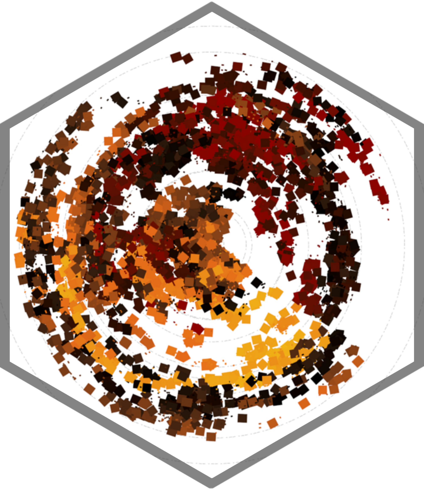

<!-- README.md is generated from README.Rmd. Please edit that file -->

```{r, include = FALSE}
knitr::opts_chunk$set(
  collapse = TRUE,
  comment = "#>",
  fig.path = "man/figures/README-",
  out.width = "100%"
)
```

# hexify

<!-- badges: start -->
<!-- badges: end -->

The goal of hexify is to ...

## Installation

You can install the development version of hexify like so:

``` r
# FILL THIS IN! HOW CAN PEOPLE INSTALL YOUR DEV PACKAGE?
```

## Example

This is a basic example which shows you how to solve a common problem:

```{r example}
hexify::hexify(from = "img/original.png", to = "img/hexagonal.png")
```

The result looks like this:


